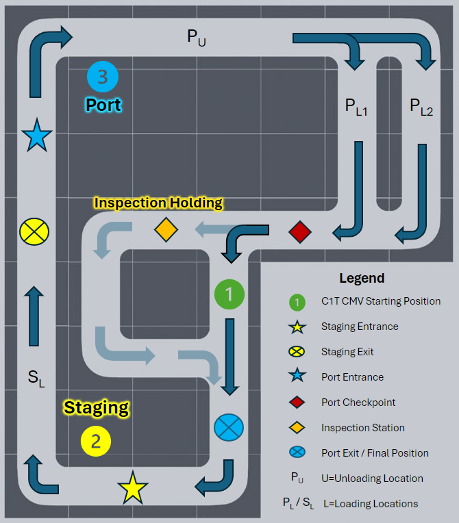

# C1T Garage Actions
These are Port Drayage actions created the CDA1Tenth functionality and specifically tailored for the Turner Fairbank Highway Research Center's Saxton Laboratory garage demonstration.

## Instructions
Replace the port_drayage.sql file in docker-compose.yml with the files in this directory.
```
db:
   image: mysql:8.0
   volumes:
       - ./mysql/garage_port_drayage/port_drayage.sql:/docker-entrypoint-initdb.d/port_drayage.sql
       - ./mysql/garage_port_drayage/port_drayage_lane1.sql:/docker-entrypoint-initdb.d/port_drayage_lane1.sql
       - ./mysql/garage_port_drayage/port_drayage_lane2.sql:/docker-entrypoint-initdb.d/port_drayage_lane2.sql
```

## Reference Layout
The following diagram displays the C1T Port Drayage layout used in the Saxton Garage. The above SQL files should be selected based on if the first (port_drayage_lane1.sql) or second (port_drayage_lane2.sql) lane will be used for the Port Pickup action.

