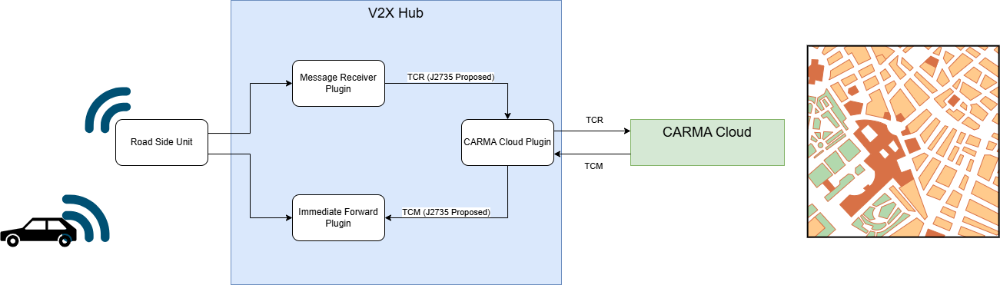

# CARMA Cloud Plugin Documentation

## Introduction

The CARMA Cloud Plugin is responsible for connecting V2X Hub to [CARMA Cloud](https://github.com/usdot-fhwa-stol/carma-cloud), which is the STOL Cloud Cooperative Driving Automation (CAD) application supporting different use cases like work-zone.

## Related Plugins

A list of plugins related to the CARMA Cloud Plugin.

### Immediate Forward Plugin

For RSU Immediate Message Forwarding (IMF) functionality forward V2X Messages like Traffic Control Messages (TCMs) from CARMA Cloud to V2X actors.

### Message Receiver Plugin

For receiving V2X communication from V2X actors like CAVs (Connected Autonomous Vehicles) sending Traffic Control Requests (TCRs)

## Configuration/Deployment

This plugin has several configuration parameters. Below these are listed out as together with descriptions on how to set them.

**WebServiceIP**: REST Server IP where V2X Hub listens for incoming messages from CARMA Cloud.

**CARMACloudIP**: REST Server IP where V2X Hub sends REST requests to CARMA Cloud.

**CARMACloudPort**: REST Server port where V2X Hub sends REST request to CARMA Cloud.

**fetchTime**: Time in days from which all TCMs will be requested from CARMA Cloud 

**TCMRepeatedlyBroadcastTimeOut**: After it receives TCM from carma cloud, it repeatedly broadcasts TCM until TCMRepeatTimeOut milliseconds.

**TCMRepeatedlyBroadcastSleep**: The repeatedly broadcast thread should sleep for number of milliseconds.

**TCMRepeatedlyBroadCastTotalTimes**: The number of times TCMs with the same request id should be repeatedly broadcast within the time out period.

**TCMNOAcknowledgementDescription**: If the plugin does not receives any aknowledgement from CMV within the configured seconds that match the original TCM, the plugin will create an NO ACK message and display it on UI.

**listTCM**: Indicator to determine if v2xhub receives a list of TCMs from carma-cloud. Default to true, returning a list of TCM. If false, return one TCM at a time. Indicator value can only be either true or false.

### TCP Tunnel

Currently to connect securely to a remotely hosted CARMA Cloud instance, an additional step is required. The configuration of a TCP tunnel, which creates a secure connection to a carma-cloud instance. The steps to configure this tunnel are :

1) Provision required `.pem` file for secure connection and move it to the `./scripts/` directory
2) Run `./call.sh` in the `./scripts/` directory.

## Design

The diagram above illustrates roughly how the CARMA Cloud Plugin functions. The CARMA Cloud Plugin maintains a connection to CARMA Cloud. When receiveing TCRs, it forwards these to CARMA Cloud, which will respond with relevant traffic controls via the TCM message. These TCMs will be broadcast to vehicles providing them updates to their local map like lane-closures or speed limits associated with dynamic work zones.

### Messages

**TCR**: This message contains information from a requesting CAV about what traffic controls it wants to know about. This includes information about time and location for which it wants traffic controls. 

**TCM**: This message contains information about traffic controls like speed limits or lane closures and geographic information about the locations they apply to.
> [!NOTE]
> **TCM** and **TRC** are CARMA ecosystem protype messages that have been proposed to the SAE standard for inclusion in J2735 V2X Message set.

## Functionality Testing

To test functionality of CARMA Cloud Plugin without an active vehicle, we have provided a script which can send mock TCRs to V2X Hub. These TCRs should be received by the CARMA Cloud Plugin, forwarded to CARMA Cloud, and if there are any relevant active traffic controls, should result in response TCMs being sent to the CARMA Cloud Plugin. Steps to conduct this test are outlined below:
1) Deploy V2X Hub and CARMA Cloud
2) Configure CARMA Cloud Plugin to connect the CARMA Cloud (including setup of any necessary TCP tunnels)
3) Enable both CARMA Cloud Plugin and Message Receiver Plugin
4) Run 'python3 tcr_script.py` to send a TCR to the Message Receiver Plugin
5) Confirm that TCM messages are being received by CARMA Cloud Plugin via the Messages tab in the V2X Hub Admin UI web portal  