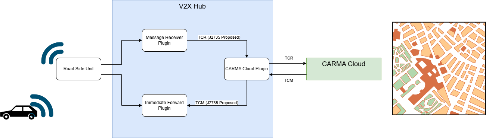

# CARMA Cloud Plugin Documentation

## Introduction

The CARMA Cloud Plugin is responsible for connecting V2X-Hub to [CARMA Cloud](https://github.com/usdot-fhwa-stol/carma-cloud), which is the STOL Cloud Cooperative Driving Automation (CAD) application supporting different use cases like work-zone.

## Related Plugins

A list of plugins related to the CARMA Cloud Plugin.

### Immediate Forward Plugin

For RSU Immediate Message Forwarding (IMF) functionality forward V2X Messages like Traffic Control Messages (TCMs) from CARMA Cloud to V2X actors.

### Message Receiver Plugin

For receiving V2X communication from V2X actors like CAVs (Connected Autonomous Vehicles) sending Traffic Control Requests (TCRs)

### Emergency Response Vehicle (ERV) Cloud Forwarding

For forwarding ERV communications from V2X actors to CARMA cloud.

## Configuration/Deployment

This plugin has several configuration parameters. Below these are listed out as together with descriptions on how to set them.

**WebServicePort**: Port for V2X-Hub to receive TCM messages from CARMA Cloud over SSH-tunnel.

**CARMACloudBaseUrl**: Host or server IP address and port for SSH-tunnel to CARMA Cloud.

**fetchTime**: Time in days from which all TCMs will be requested from CARMA Cloud 

**TCMRepeatedlyBroadcastTimeOut**: After it receives TCM from carma cloud, it repeatedly broadcasts TCM until TCMRepeatTimeOut milliseconds.

**TCMRepeatedlyBroadcastSleep**: The repeatedly broadcast thread should sleep for number of milliseconds.

**TCMRepeatedlyBroadCastTotalTimes**: The number of times TCMs with the same request id should be repeatedly broadcast within the time out period.

**TCMNOAcknowledgementDescription**: If the plugin does not receives any aknowledgement from CMV within the configured seconds that match the original TCM, the plugin will create an NO ACK message and display it on UI.

**listTCM**: Indicator to determine if v2xhub receives a list of TCMs from carma-cloud. Default to true, returning a list of TCM. If false, return one TCM at a time. Indicator value can only be either true or false.

**enforceTLSVerification**: Indicator to determine if v2xhub should enforce TLS verification for CARMA-Cloud connnection. Default to true. False should **ONLY** be used for development and debugging purposes; further must be compiled as a Debug build.

### TCP Tunnel

To securely connect V2X-Hub to a remotely hosted CARMA Cloud instance, SSH tunnels must be configured. The forward tunnel forwards HTTPS traffic from V2X-Hub's local host environment to the remote CARMA Cloud server.  The reverse tunnel forwards TCM reply traffic from the remote CARMA Cloud server to V2X-Hub's local host environment. The steps to configure these tunnels are:

1. Provision the required `.pem` key file for SSH authentication and place it in the `./scripts/` directory.

2. Run `./call.sh` from the `./scripts/` directory to establish the SSH tunnel.

3. Start V2X-Hub. Configure the `CARMACloudPlugin`:
   * Set `CARMACloudBaseUrl` to use HTTPS and port `8443`
   * Example: `https://host.docker.internal:8443`

## Design

The diagram above illustrates roughly how the CARMA Cloud Plugin functions. The CARMA Cloud Plugin maintains a connection to CARMA Cloud. When receiveing TCRs, it forwards these to CARMA Cloud, which will respond with relevant traffic controls via the TCM message. These TCMs will be broadcast to vehicles providing them updates to their local map like lane-closures or speed limits associated with dynamic work zones.
### Messages

**TCR**: This message contains information from a requesting CAV about what traffic controls it wants to know about. This includes information about time and location for which it wants traffic controls. 

**TCM**: This message contains information about traffic controls like speed limits or lane closures and geographic information about the locations they apply to.
> [!NOTE]
> **TCM** and **TRC** are CARMA ecosystem protype messages that have been proposed to the SAE standard for inclusion in J2735 V2X Message set.

## Technical Communication Flow

### Request traffic
The Message Receiver Plugin receives a TCR from an RSU and publishes it to the CARMA Cloud Plugin. The CARMA Cloud Plugin then sends a TCM request with the TCR message to CARMA Cloud using an HTTPS POST over the SSH forward tunnel. CARMA Cloud processes the request and prepares to return the appropriate HTTP TCM response initiated by CARMA Cloud server to V2X-Hub. 

> [!WARNING]
> This does not follow the typical HTTP request/response pattern.  CARMA Cloud initiates a seperate HTTP TCM response back to V2X-Hub after processing the TCM request.

### Request communication flow with code references:
```
Message Receiver Plugin
    ↓
CARMA Cloud Plugin: CARMACloudPlugin::CloudSend() sends HTTPS POST to `https://host.docker.internal:8443/carmacloud/tcmreq` (or the configured CARMACloudBaseUrl/carmacloud/tcmreq)
    ↓
SSH forward tunnel which maps the local HTTPS endpoint to the remote CARMA Cloud server (e.g., V2X-Hub’s localhost:33333 not container localhost to CARMA Cloud’s localhost:8443)
    ↓
CARMA Cloud: TcmReqServlet.doPost() / run() handles `/carmacloud/tcmreq`
```

> [!IMPORTANT]
> - HTTPS is used for communication between V2X-Hub and CARMA Cloud to improve transport security and support stronger TLS configurations.
> - WARNING: The SSH forward tunnel is required still because CARMA Cloud's `TcmReqServlet.java` reads the caller’s IP address with `getRemoteAddr()` for the TCM response.
> - The SSH forward tunnel is configured with the `-g` option so Docker containers can access the forwarded port through `host.docker.internal`.
> - `host.docker.internal` should be used when the SSH tunnel is established on the host machine while V2X-Hub is running inside a Docker container.
> - The default HTTPS forwarding port is `8443`, but this may vary depending on deployment configuration.

### Reply traffic
CARMA Cloud sends TCM reply using host from TCR HTTPS request and port defined in TCR message via HTTP post over SSH reverse tunnel. V2X-Hub's CARMA Cloud Plugin process.

CARMA Cloud’s TomcatTcmReqServlet.run() handles reply → POST to http://127.0.0.1:22222/tcmreply(or whatever the source IP was for carmacloud/tcmreq and port in TCM message)  → SSH reverse tunnel maps CARMA Cloud’s localhost:22222 back to plugin localhost:22222 → CARMACloudPlugin::CARMAResponseHandler handles /tcmreply

## Functionality Testing

To test functionality of CARMA Cloud Plugin without an active vehicle, we have provided a script which can send mock TCRs to V2X Hub. These TCRs should be received by the CARMA Cloud Plugin, forwarded to CARMA Cloud, and if there are any relevant active traffic controls, should result in response TCMs being sent to the CARMA Cloud Plugin. Steps to conduct this test are outlined below:
1) Deploy V2X Hub and CARMA Cloud
2) Configure CARMA Cloud Plugin to connect the CARMA Cloud (including setup of any necessary TCP tunnels)
3) Enable both CARMA Cloud Plugin and Message Receiver Plugin
4) Run 'python3 tcr_script.py` to send a TCR to the Message Receiver Plugin
5) Confirm that TCM messages are being received by CARMA Cloud Plugin via the Messages tab in the V2X Hub Admin UI web portal  