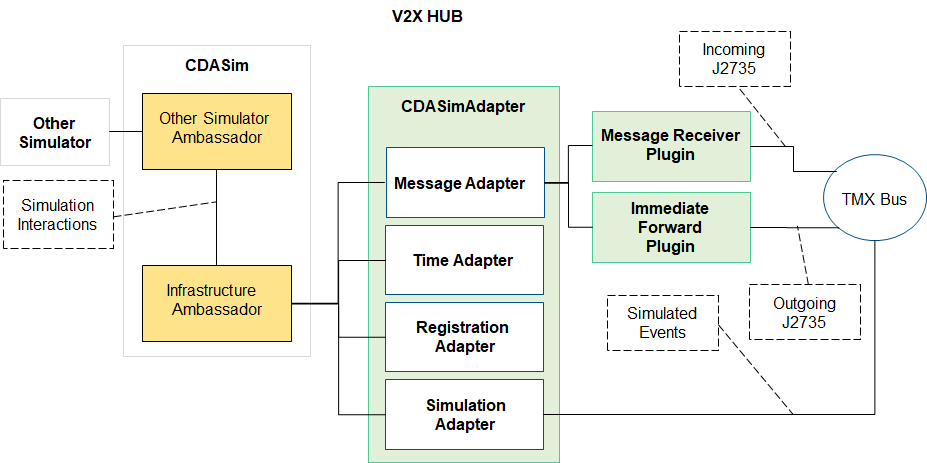

# CDASim Adapter Plugin Plugin Documentation

## Introduction

This Plugin is an adapter for integration with the **CDASim Co-simulation** enviroment. 

## Related Plugins

A list of plugins related to the CDASim Adapter Plugin.

### Immediate Forward Plugin

For RSU Immediate Message Forwarding (IMF) functionality forward J2735 messages to CDASim.

### Message Receiver Plugin

The Message Receiver Plugin for receiving incoming J2735 message from CDASim.

## Configuration/Deployment

### System Configuration

This plugin uses several system configuration parameters set as enviroment variables described below.

**SIMULATION_MODE** – Environment variable for enabling simulation components for V2X-Hub. If set to "true" or "TRUE" simulation components will be enable. Otherwise, simulation components will not be enabled.

**SIMULATION_IP** – Environment variable for storing IP address of CDASim application.

**SIMULATION_REGISTRATION_PORT** – Environment variable for storing port on CDASim that handles registration attempts.

**TIME_SYNC_PORT** – Environment varaible for storing port for receiving time sync messages from CDASim.

**V2X_PORT** – Environment variable for storing port for receiving v2x messages from CDASim

**SIM_V2X_PORT** – Environment variable for storing port for sending v2x messages to CDASim

**V2XHUB_IP** – Environment variable for storing IP address of V2X Hub.

**INFRASTRUCTURE_ID** – Environment variable for storing infrastructure id of V2X Hub.

**SENSOR_JSON_FILE_PATH** – Environment variable for storing path to sensor configuration file. This is an optional simulation environment variable that allows for setting up simulated sensor for a V2X-Hub instance. Example file can be found in the **CDASimAdapterPlugin** tests [here](../src/v2i-hub/CDASimAdapter/test/sensors.json).

### Plugin Configuration

In addition to the system configuration, the CDASim Adapter also has plugin configuration parameters that can be set via the admin portal.

**LogLevel**:The log level for this plugin"

**X**:Cartesian X coordinate in simulated map (in meters).

**Y**:Cartesian Y coordinate in simulated map (in meters).

**Z**:Cartesian Z coordinate in simulated map (in meters).

**MaxConnectionAttempts**:Number of connection attempts CDASimAdapter plugin will execute before failing. Valid values are any integers greater than or equal to 1. Any value less than 1 will result in unlimited connection attemtps.

**ConnectionSleepTime**:Number of seconds to wait after a failed CDASim connection attempt, before retrying to establish connection. Valid values are equal or greater than 1. Any value less than 1 will be treated as 1.

## Design

### Communication

The integration with the **CDASim Co-simulation** enviorment consists of 4 major parts:

**Registration Adapter**: The CDASimAdapter will establish a unique connection with CDASim and provide configuration information about harware like RSUs or Sensors associated with V2X-Hub.

**Time Adapter**: The CDASimAdapter will consume and broadcast simulation time from the CDASim enviromment to ensure all plugins are using simulation time in place of machine time.

**Message Adapter**: The CDASimAdapter will forward V2X messages to CDASim for simulated radio broadcast. It will also listen for incoming simulated V2X message recptions for the RSUs it registered with CDASim.

**Simulation Adapter**: This final part captures any simulated events V2X-Hub needs to listen for. An example is Sensor Detections. When registering a sensor with CDASim, the sensor is created and detections from that sensor need to be forwarded to V2X-Hub. The simulation adapter will listen for these events from CDASim and broadcast them on the TMX message bus for other plugin.

### Messages

**Time Sync Message**: A V2X-Hub message that all PluginClientClockAware plugins subscribe to when running V2X-Hub in the simulation environment. This updates the base class clock object to allow for seamless integration of plugins into the simulation environment. 

**Sensor Detected Object**: V2X-Hub's generic message for detection data. This message is generated when the CDASim adapter receives a detection interaction for one of the sensors it registers.

## Functionality Testing

Included in this directory is a `scripts` directory that includes scripts to mock a CDASim Server listening for simulation registration events (`udp_socket_server.py`), time steps sent from CDASim (`send_timestep_udp.py`), and simulated detection events sent from CDASim (`send_sim_detected_object_udp.py`). These can be used to test functiontionality associated with the **CDASimAdapter Plugin**
