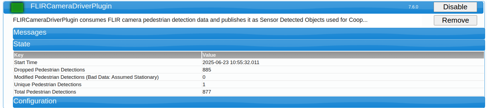
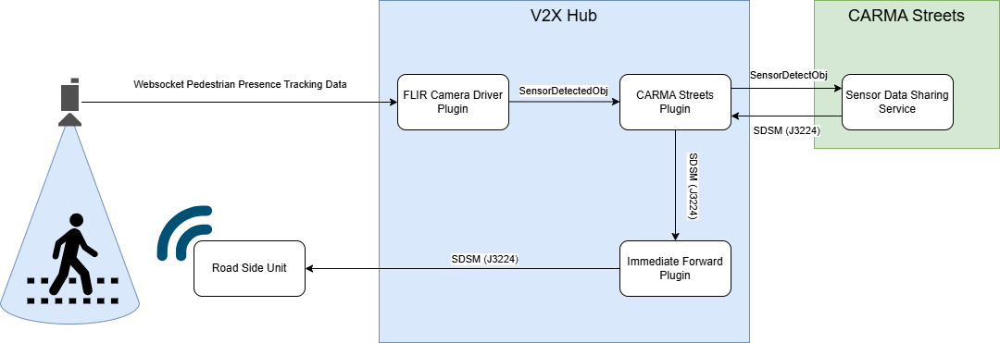

# FLIR Camera Driver Plugin Documentation

## Introduction
The FLIR Camera Driver Plugin is the hardware interface for the FLIR Sensor. It contains logic to translate FLIR Sensor Pedestrian Presence Tracking information into V2X Hub Sensor Detections. These detections can be consumed by downstream plugins or services for J2735 Message Generation. Currently this is support by the [CARMA Streets](https://github.com/usdot-fhwa-stol/carma-streets) [Sensor Data Sharing Service](https://github.com/usdot-fhwa-stol/carma-streets/tree/develop/sensor_data_sharing_service) which will generate SDSMs

## Related Plugins

A list of plugins related to the FLIR Camera Driver Plugin.

### Immediate Forward Plugin

For RSU Immediate Message Forwarding (IMF) functionality forward any generated J2735 message to RSU (e.g. SDSM)

### CARMA Streets Plugin

The CARMA Streets plugin is required for SDSM generation since this is handled by the [CARMA Streets](https://github.com/usdot-fhwa-stol/carma-streets) [Sensor Data Sharing Service](https://github.com/usdot-fhwa-stol/carma-streets/tree/develop/sensor_data_sharing_service). For this functionality the FLIR Camera Driver Plugin generates Sensor Detected Object messages, which are forwarded to the Sensor Data Sharing service via the CARMA Streets plugin. The Sensor Data Sharing Service then generates SDSMs which are sent back to V2X Hub via the CARMA Streets Plugin  and broadcast to the RSU via the Immediate Forward Plugin.


## Configuration/Deployment

This plugin has several configuration parameters. Below these are listed out as together with descriptions on how to set them.

**FLIRConfigurations**: JSON string configuration parameters which contains on or more FLIR Camera(s) to connect to.

```json
[
  {
    "WebSocketHost": "127.0.0.1", // IP Address of FLIR Camera
    "WebSocketPort": "8081", // Websocket port
    "Endpoint": "/api/subscriptions", // Websocket endpoint
    "CameraRotation": 16.13, // Camera heading measure in degrees clockwise from North
    "SensorId": "FLIR_Turner_Parking_Lot" // Sensor Id 
  },
  {
    "WebSocketHost": "127.0.0.1",
    "WebSocketPort": "8082",
    "Endpoint": "/api/subscriptions",
    "CameraRotation": 11.13,
    "SensorId": "FLIR_Crosswalk"
  }
]
```

## Status Information

This plugin includes some custom status information to allow for real-time monitoring of FLIR Camera detection data. Included are:

**Dropped Pedestrian Detections** : A complete count of all pedestrian detections from all FLIR Camera connections that were dropped due to inability to process the information
**Modified Pedestrian Detections (Bad Data: Assumed Stationary)**: A complete count of all pedestrian detections from all FLIR Camera connections that were modified due to bad incoming data.
> [!NOTE]  
> We only modify incoming detections that have incomplete/invalid heading/speed information. After testing we have found that occassionally, when a detected object stops, the FLIR Camera will continue to broadcast detections that **do not** include angle or heading but **do** include speed. This seems to be a bug that only occurs for stationary objects intermittently. To address this, when no angle is provided, we assume speed is 0. For tracebility we have added this status as well as a flag in each SensorDetectedObjectMessage which indicates whether we have modified the detection data from the source sensor at all.
**Unique Pedestrian Detections**: A complete count of all pedestrian detections from all FLIR Camera connections that are unique. We evaluate this by comparing the incoming detection ids to the previously received ids. This is meant to be a rough estimate of all pedestrians detected by the FLIR Cameras connected.
**Total Pedestrian Detections**: A complete count of all pedestrian detections from all FLIR Camera connections. This includes any detections that where dropped or modified.
**Live number of currently detected pedestrians**: A current/live count of unique pedestrian detections from all FLIR Camera connections.




## Design


Above is a diagram illustrates how the FLIR Camera Driver Plugin is used to create Sensor Data Sharing Messages (SDSM) for Cooperative Perception.

### Messages

**SensorDetectedObject**: V2X Hub message that contains detection data. Can be used to generate other messages like SDSM.

**SensorDataSharingMessage**: V2X Cooperative Perception message defined in the J3224 standard.


## Functionality Testing
In the `./scripts/` directory in this plugin we have created a simply python script that mocks the websocket hosted by the FLIR Camera for pedestrian presence tracking. To confirm plugin functionality this script can be used to mock the output of the FLIR Camera

1) Install Python3 and Pip.
2) Run `python3 -m pip install -r scripts/requirements.txt` to install depedencies.
3) Run `python3 scripts/mockFLIRCamera.py --ip <ip> --port <port>`
4) Configure FLIR Camera Driver Plugin for connection to the websocket and in the **Messages** tab of the plugin you should see Sensor Detected Objects publishing. 
