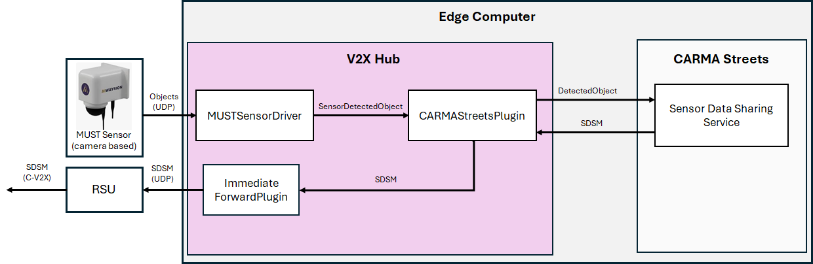
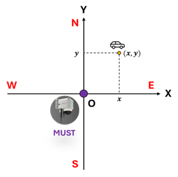
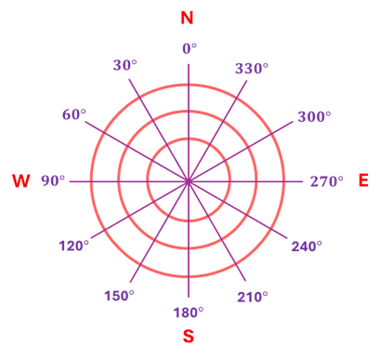
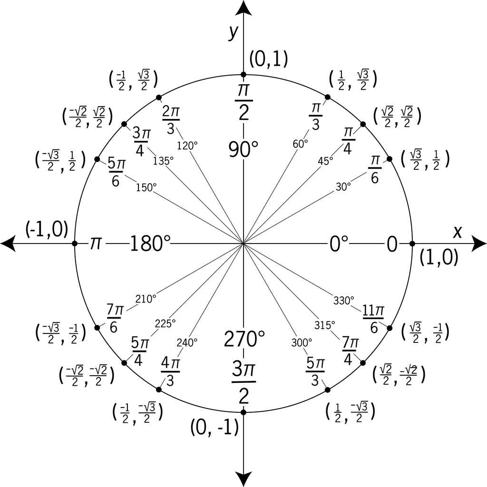
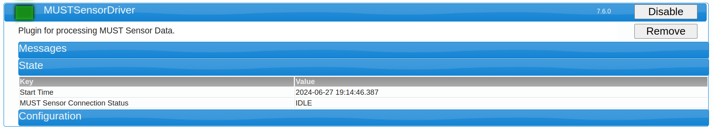
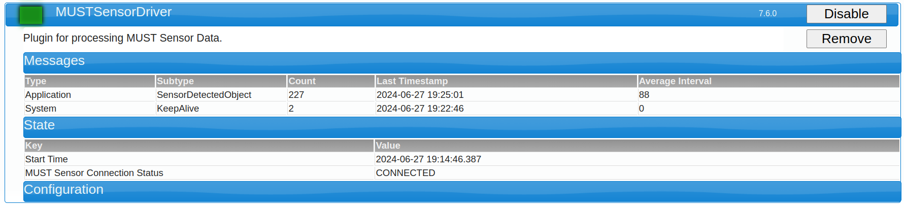

# MUST Sensor Driver Plugin Documentation

## Introduction

[MUST](https://www.aiwaysion.com/technology) (Mobile Unit for Sensing Traffic) Sensor from AI Waysion is a camera based sensor, planned to be used for cooperative perception in freight use cases. The MUST Sensor provides detections via UDP packets made up of CSV (Comma Separated Values) string data. The V2X-Hub MUST Sensor Driver Plugin will then consume these messages and translate them to **Sensor Detected Object** messages, which is V2X-Hub's generic detection message. This message is consumable by the  **CARMA Streets [Sensor Data Sharing Service](https://github.com/usdot-fhwa-stol/carma-streets/blob/develop/sensor_data_sharing_service/README.md)** which will generate **Sensor Data Sharing Message**s according to the J3224 standard for broadcast to other traffic actors in the area.

## Related Plugins

A list of plugins related to the MUST Sensor Driver Plugin.

### Immediate Forward Plugin

For RSU Immediate Message Forwarding (IMF) functionality forward SDSMs (Sensor Data Sharing Message).

### CARMA Streets Plugin

For forwarding detection data (SensorDetectedObject) to **[Sensor Data Sharing Service](https://github.com/usdot-fhwa-stol/carma-streets/blob/develop/sensor_data_sharing_service/README.md)** for creation of SDSMs.

## Configuration/Deployment

This plugin has several configuration parameters. Below these are listed out as together with descriptions on how to set them.

**DetectionReceiverIp**: This is the IP address on which V2X-Hub will listen for detections. In most scenarios this can be left at default since 127.0.0.1 should resolve to the IP address of V2X-Hub.

**DetectionReceiverPort**: This is the Port on which V2X-Hub will list for detection. In most scenarios this can be left at default as well. The MUST Sensor must be configured to broadcast it's detection information to the configured IP and Port.

**SensorId**: This is a unique string identifier for this sensor. Multiple instances of MUST Sensors can be connected via multiple instances of this plugin. Additionally other sensors can also be connected to V2X-Hub conccurently. For cooperative perception functionality to work correctly, each of these sensors must have a unique string identifier.

> [!NOTE]
> V2X-Hub currently has no mechanism by which to verify that all configured sensors have unique string indentifies. Currently this can only be verified via manual inspection.

**ProjectionString**: This parameter holds a string that describes coordinate transforms necessary for projecting the detection data provide in cartesian coordinates to WSG84 coordinate frame.

> [!NOTE]
> Both **CARMA Streets** and our vehicle automatation **CARMA Platform** rely on the PROJ4 library for projecting data between internal local maps coordinate frames and WSG84. Additional documentation on the projection string can be found in PROJ documentation (<https://proj.org/en/9.4/index.html>)(<https://proj.org/en/9.4/usage/quickstart.html>)(<https://proj.org/en/9.4/usage/transformation.html>)

After setting these configuration parameters the plugin can simply be enabled.

## Design


This plugin consists of a simple UDP Server listening for detection data from the MUST Sensor. Each received detection is deserialized and translated to a **Sensor Detected Object** message. Then this **Sensor Detected Object** message is forward on the TMX Message bus. If enabled, the **CARMA Streets Plugin** will receive this message, forward it to the **CARMA Streets [Sensor Data Sharing Service](https://github.com/usdot-fhwa-stol/carma-streets/blob/develop/sensor_data_sharing_service/README.md)** which is responsible for generating SDSMs from detection data. These SDSMs are sent back to V2X-Hub for broadcast to vehicle's via the RSU (Road Side Unit).

### Coordinate Frame Translation

MUST Sensor produces detection data as CSV Strings. The detection data includes position as a 2 dimensional cartesian offset (in meters) from the sensor location. Velocity is provided using a NE (yNorth xEast) heading (in degrees) and a speed (in m/s). This needs to be translated to an ENU (xEast,yNorth,zUp) cartesian cordinate position and velocity vector. The position does not need any translation since both of xEast yNorth. The heading and speed must be translated to a velocity vector using trigonometry.




To convert the heading to unit circle we simple subtract 270 degrees from any heading value, then we can take the `cos()` for x values and the `sin()` for y values.



### Messages

**Sensor Detected Object**: V2X-Hub's generic message for detection data.

## Functionality Testing

Included in this directory is a script that can be used to provide Mock MUST Sensor data. Start up plugin and use `scripts/MockMUSTSensor.py` script to send mock detection data from a single mock object to plugin at 30 Hz. The script will update the timestamp of this object as well as move it randomly in space. 

```bash
Script to mock detection data coming from MUST Sensor

options:
  -h, --help   show this help message and exit
  --ip IP      IP address to send detection data to.
  --port PORT  Port to send detection data to.
```

Addition addition objects for which to send mock detections can be done by appending detections to the `detections` array in the python script.

### Confirming Functionality

On startup of the plugin, the V2X-Hub Web UI should show the plugin as enabled and the `MUST Sensor Connection Status` should be `IDLE` reflecting that the plugin is listening for detections but has not yet received any.

After running the `MockMUSTSensor.py` script the `MUST Sensor Connection Status` should be `CONNECTED` reflecting that it is currently receiving valid messages from the MUST Sensor. Additionally the **Messages** tab will reveal that the plugin is also sending **SensorDetectedObject** messages as a result.

A status of `DISCONNECTED` represents some error behavior that is likely related to the connection or the incomming data. Please inspect configuration parameters on the MUST Plugin and the MUST Sensor Detection data and confirm it is valid