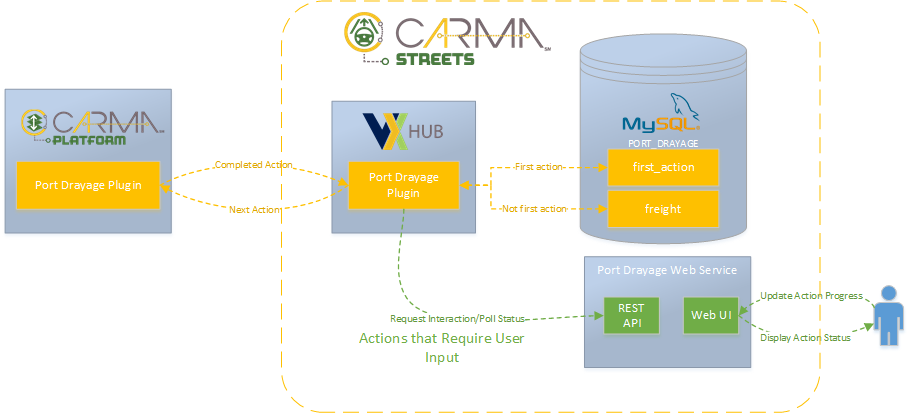
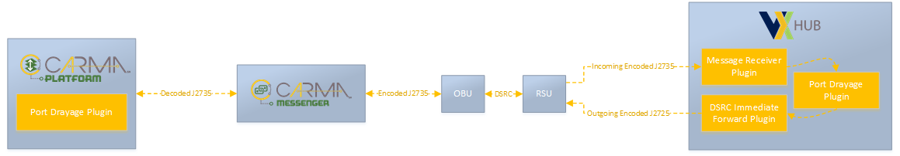

# Port Drayage Plugin Documentation

## Introduction

The Port Drayage Plugin in V2x-Hub facilitates infrastructure, vehicle and container handling equipment (CHE) communication for port drayage operations. The plugin provides and montior drayage actions for a freight truck inside and between a mock port and staging area. The list of actions includes ENTER_STAGING_AREA, PICKUP, EXIT_STAGING_AREA, ENTER_PORT, DROPOFF, PORT_CHECKPOINT, HOLDING_AREA, and EXIT_PORT.

## Related Plugins

A list of plugins related to the Port Drayage functionality.

### Immediate Forward Plugin

For RSU Immediate Message Forwarding (IMF) functionality to communicate with a freight vehicle.

### Message Receiver Plugin

For receiving vehicle communication from freight vehicles.

## Configuration/Deployment

Port Drayage Plugin default configuration parameters work for docker-compose deployment. The include configuring Port Drayage MySQL server address, database credentials and Port Drayage Web Application address. 

1) Populate actions in DB (Sample action databases can be found under `configuration/mysql/port_drayage.sql`)
2) Enable Plugin

## Design



The infrastructure component of the Port Drayage CARMA-Freight Use Case has 3 major actors that all fall under the CARMA-Streets umbrella: V2X-Hub , MySQL Database ,and Port Drayage Web Service.
### V2X-Hub
V2X-Hub is a message handler that acts as a translator and data aggregator/disseminator for infrastructure components of a connected vehicle deployment.  It is built with a plugin architecture, meaning to add new custom functionality, new plugins can be written to consume and produce J2735 messages that are broadcast over DSRC. For the Port Drayage CARMA-Freight Use Case, the Port Drayage Plugin is responsible for receiving/transmitting Mobility Operation messages from a CARMA equipped vehicles and facilitating any necessary communication with CHE or inspection personnel to complete port drayage operations. This includes container pickup, drop off, vehicle inspection and entrance or exit gate interactions at a port or staging area.

### MySQL database
The MySQL database stores vehicle instructions called actions. V2X-Hub will query this database to provide vehicles actions one by one. Actions consist mainly of a UUID to identify each action, a vehicle ID to identify the recipient for an action, a cargo ID to identify any cargo associated with the action, and an operation to describe the action.   MySQL Database that contains two tables. The `first_action` table is used to store vehicles first actions. The `freight` table is used to store all vehicle actions. Each action in the database includes the UUID string action id of the next action to link actions of a single vehicle in sequence. A sequence of actions for a given vehicle consists of a first action stored in the `first_action` table and subsequent linked actions stored in the `freight` table. The first action is provided to the vehicle as a response to initial communication. After completing an action, the vehicle will broadcast the completed action. The Port Drayage Plugin will then attempt to use the completed action to retrieve the next action from the `freight` table.

### Port Drayage Web Service
The Port Drayage Web Service is a java spring application that contains a REST API server and a web user interface created using java Thyme Leaf. Some port drayage actions require user input from personnel operating CHE or from inspection personnel.  The Port Drayage Web Service was created to allow personnel, through a web UI, to interact with actions that require user input. Supported actions that require user input include `LOADING`, `UNLOADING`, and  `INSPECTION`. User input actions differ from other actions in that they require user input to be considered completed and therefor also for the vehicle to be provided with its next action. The  Port Drayage Web Service maintains the state of these actions and hosts the web UI through which input is received.

### Communication


The infrastructure software designed for the CARMA-Freight Port Drayage use case contains several different lines of communication. The first and most important, facilitating communication between infrastructure and the vehicle. To communicate, we use SAE J2735 messages broadcast over DSRC. Specifically, in this standard we use the Mobility Operations Message, often used for prototyping messages, since it has a simple string payload and a strategy field to give information to receiving software on how to interpret the string payload.

The Mobility Operation Messages used for this plugin, incoming and outgoing, are designated with the strategy `carma/port_drayage`. Messages from the CMV indicate the CMV’s completion of an action, while messages from V2XHub indicate an instructed operation to the CMV.  The sample message below shows the JSON payload contained within the Mobility Operation message’s `strategy_params` field.

```json
// Example Mobility Operation strategy_params JSON payload with message's strategy set to "carma/port_drayage":
{
  "cmv_id": "DOT-80550",                // [Required from all] string unique identifier for CMV 
  "operation": "ENTERING_STAGING_AREA", // [Required from all] Enum to indicate the type of action
                                        // NOTE: Possible operations include: PICKUP, DROPOFF, PORT_CHECKPOINT, HOLDING_AREA, 
                                        //                                    ENTER_STAGING_AREA, EXIT_STAGING_AREA, ENTER_PORT, EXIT_PORT
  "cargo": false,                       // [Required from all with PICKUP/DROPOFF operation] boolean flag to indicate whether the CMV is loaded with cargo
  "cargo_id": "SOME_CARGO",             // [Required from all with PICKUP/DROPOFF operation] string unique identifier for cargo
  "location": {                         // [Required from CMV] current location of the CMV
    "longitude": 0, 
    "latitude": 0}, 
  "destination": {                      // [Required from infrastructure] optional destination for CMV
    "longitude": 0,
    "latitude": 0},
  "action_id": "SOMEUID"                // [Required from all] string UUID to identify action
  }

```

For the actions with the operations `PICKUP` (`LOADING`), `DROPOFF` (`UNLOADING`), `PORT_CHECKPOINT` (`INSPECTION`), and  `HOLDING_AREA` (`INSPECTION`) require user input from container handling equipment (CHE) personnel and inspection personnel. We also use RESTful communication to connect the V2X-Hub Port Drayage Plugin to the Port Drayage Web Service. RESTful communication contains a client (V2X-Hub) and a server (Port Drayage Web Service). The file included below is the OpenAPI API definition, which defines the endpoint, possible requests, possible responses and the JSON objects exchanged between client and service.

The final method of communication is SQL (Structure Query Language). To query the MySQL database for each action in a sequence, the V2X-Hub Port Drayage Plugin uses mysql connecter client library to make SQL queries and receive the results. [A sample SQL file](`configuration/mysql/port_drayage.sql`) used to setup both the `freight` and `first_action` tables in the PORT_DRAYAGE MySQL database.


## Functionality Testing

Open another tab and type in `localhost:8090` to navigate to port drayage web UI. Click `Staging Area` or `Port Area` button to test V2x-Hub located at staging or port area.

Open a terminal, and run [a python script](https://raw.githubusercontent.com/usdot-fhwa-OPS/V2X-Hub/develop/configuration/mysql/suntrax/momscript_port_drayage.py) to send mocked mobility operation message to test each action at a particular location.
```
./momscript_port_drayage.py
```


