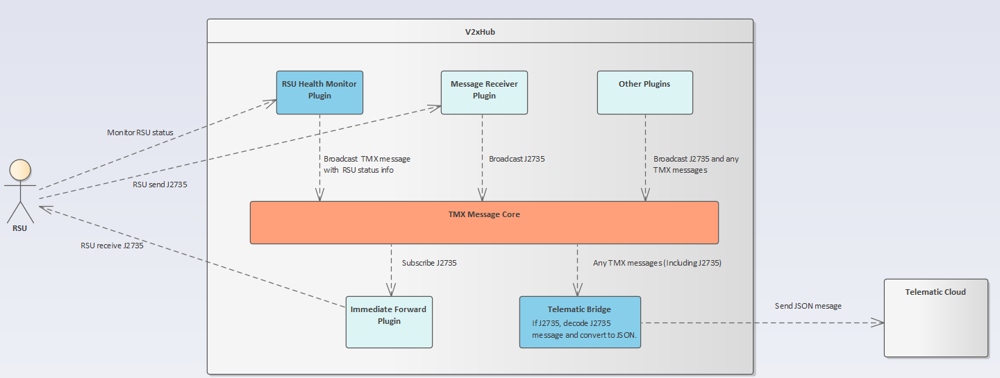
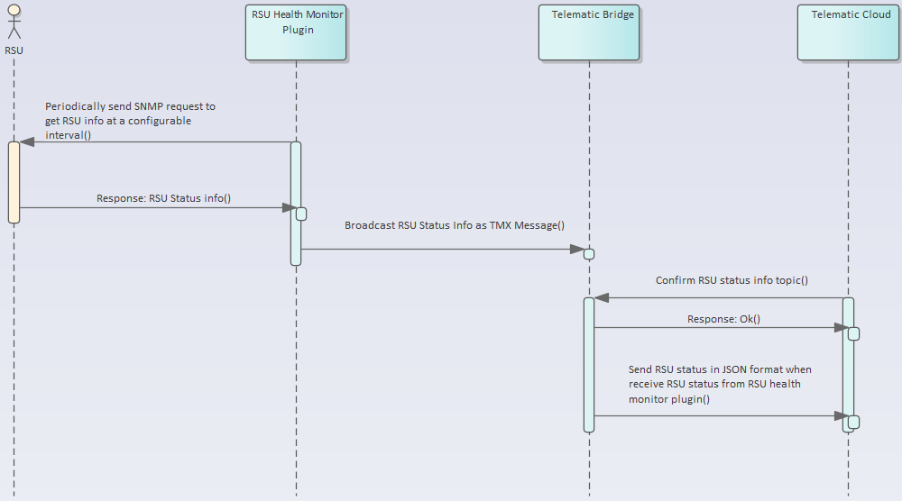

# RSU Health Monitoring Plugin Documentation

## Introduction

The RSU Health Monitoring is responsible for polling OIDs on the RSU to populate a **RSUStatus** message. The RSU Health Monitoring currently supports SNMP versions 1,2 and 3 as well as the **RSU 4.1 specification** and the **NTCIP 1218 specification**

## Related Plugins

A list of plugins related to the RSU Health Monitoring Plugin.

### Immediate Forward Plugin

RSU Health Monitoring Plugin can be used to evaluate the health and status of RSUs to which V2X Hub is sending J2735 messages for broadcast.

### Message Receiver Plugin

RSU Health Monitoring Plugin can be used to evaluate the health and status of RSUs from which V2X Hub is receiving J2735 messages.

### Telematics Bridge Plugin

**RSUStatus** messages are consumable by the ITS Telematics Tool for visualization and monitoring

## Configuration/Deployment

This plugin has several configuration parameters. Below these are listed out as together with descriptions on how to set them.

**Interval**: The interval on which to poll RSU status in seconds.(Default: 1 second)

**RSUConfigurationList**: A JSON list of RSU SNMP connection configurations.(see example below)

```json
{
  "RSUS": [
    {
      "RSUIp": "192.168.55.20", // IP of RSU
      "SNMPPort": "161",    // SNMP port for RSU
      "SecurityLevel": "authPriv",  // SNMP security level
      "AuthProtocol": "SHA-512",    // SNMP Authentication Protocol
      "AuthPassPhrase": "dummy123", // SNMP Authentication Pass Phrase
      "PrivacyProtocol": "AES-256", // SNMP Privacy Protocol
      "PrivacyPassPhrase": "dummy123", // SNMP Privacy Pass Phrase
      "User": "authOnlyUser", // SNMP user
      "RSUMIBVersion": "NTCIP1218" // RSU spec / MIB Version (Currently support NTCIP1218 and RSU4.1)
    }
  ]
}
```


## Design

The diagrams below illustrates roughly how the RSU Health Monitoring Plugin functions. The first highlights communicationa and the second is a sequence diagram describing interactions.


 

### Messages

**RSUStatus**: This message contains status information obtained from SNMP OIDs polled on the RSU.

```json
{
  "header": {
    "type": "Application",
    "subtype": "RSUStatus",
    "encoding": "json",
    "timestamp": "1699556405583",
    "flags": "0",
    "source": "RSUHealthMonitor"
  },
  "payload": {
    "rsuFirmwareVersion": "mk6c-19.Release.130837-RSU1609-t",
    "rsuGpsOutputStringLatitude": "38.953074999999998",
    "rsuGpsOutputStringLongitude": "-77.143073330000007",
    "rsuID": "RSU 4.1",
    "rsuIFMDsrcMsgId": "0",
    "rsuIFMEnable": "0",
    "rsuIFMIndex": "0",
    "rsuIFMPsid": "0",
    "rsuIFMStatus": "0",
    "rsuIFMTxChannel": "0",
    "rsuIFMTxMode": "0",
    "rsuManufacturer": "Cohda Wireless",
    "rsuMibVersion": "rsuMIB 4.1 rev201812060000Z",
    "rsuMode": "4"
  }
}
```


