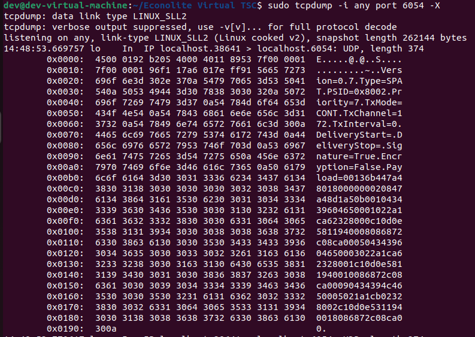
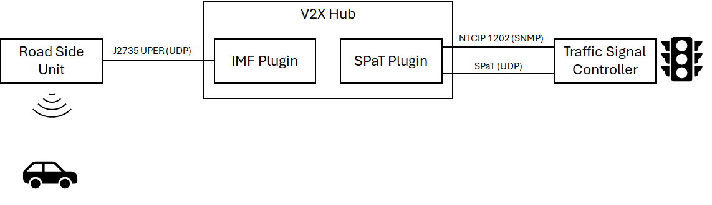

# SPaT Plugin Documentation

## Introduction

The SPaT Plugin is responsible for receiving information from the Traffic Signal Controller (TSC or SC) necessary for broadcasting Signal Phase and Timing (SPaT) messages. This includes querying any SNMP objects to determine TSC state and listen for any broadcast SPaT information from the TSC.

## Related Plugins

A list of plugins related to the SPaT Plugin.

### Immediate Forward Plugin

For RSU Immediate Message Forwarding (IMF) functionality forward SPaT (Signal Phase and Timing Messages).

### Map Plugin

The SPaT and MAP messages are strongly related in that MAP messages are required to be able to understand SPaT messages. Map
messages offer data about which signal groups impact which lanes in a given intersection.

## Configuration/Deployment

This plugin has several configuration parameters. Below these are listed out as together with descriptions on how to set them.

**Intersection_ID**: The intersection id for SPAT generated by this plugin (Note Only used in SPAT MODE = BINARY).

**Intersection_Name**: The intersection name for SPAT generated by this plugin (Note Only used in SPAT MODE = BINARY).

**SignalGroupMapping**: JSON data defining a list of SignalGroups and phases (Note Only used in SPAT MODE = BINARY).

**Local_IP**: The IPv4 address of the local computer for receiving Traffic Signal Controller Broadcast Messages.

**Local_UDP_Port**: The local UDP port for reception of Traffic Signal Controller Broadcast Messages from the TSC.

**TSC_IP**: The IPv4 address of the destination Traffic Signal Controller (TSC).

**TSC_Remote_SNMP_Port**: The destination port on the Traffic Signal Controller (TSC) for SNMP NTCIP communication."

**SPAT_Mode**: The format of received SPAT from Traffic Signal Controller (TSC). Acceptance values are BINARY and J2735_HEX.
> [!NOTE]
> **J2735_HEX** is a new added SPAT format. If your TSC is able to send UPER SPAT directly to an RSU, this is the format in which it is being sent. Below is a screen shot of J2735_HEX SPaT via TCP Dump


## Design


The diagram above illustrates roughly how the SPaT Plugin functions. The SPaT Plugin is able to get and set Traffic Signal Controller (TSC or SC) configuration via SNMP requests. The defined objects and behaviour are standardize via NTCIP 1202, the National Transportation Communications for ITS Protocol Object Definitions for Actuated Signal Controllers (ASC) Interface. It also receives live Signal Phase and Timing Data from the TSC via UDP packets. Using this information, the SPaT plugin generates J2725 SPaT messags which are eventually forwarded to and Road Side Unit (RSU) radio for broadcast to actors at or near the intersection.

### Messages

**SPAT**: This message contains information from the traffic signal controller about Signal Phase and Timing (SPaT). To use this information for vehicle control the MAP message is also required for mapping signal phase to lanes in an intersection.

## Functionality Testing

Testing the functionality of a configured instance of the SPaT plugin requires access to a Traffic Signal Controller (TSC) or Virtual Traffic Signal Controller.

1) Configure the TSC to broadcast SPAT to an open port your edge device.
   1) Take note of the format of this data. This can be done by consulting the TSC manual or by inspecting it using `tcpdump -i any port <open_port> -X`.**BINARY** payloads will be complete human unreadable collection of bytes and **J2735_HEX** will include human readable header information like `Type=SPAT`, `PSID=0x8002`, and a `Payload` followed by string HEX of the UPER encoded J2735 SPaT message.
2) Inspect the configurations of your TSC to determine Signal Group to phase mapping and the SNMP port. This can be found either at the **Channel Table** or the **Load Switch Configuration** on the TSC. Using these configurations create your signal group mapping JSON (Example shown below)
```json

{"SignalGroups":
    [
        {"SignalGroupId":1,"Phase":1,"Type":"vehicle"},
        {"SignalGroupId":2,"Phase":2,"Type":"vehicle"},
        {"SignalGroupId":3,"Phase":3,"Type":"vehicle"},
        {"SignalGroupId":4,"Phase":4,"Type":"vehicle"},
        {"SignalGroupId":5,"Phase":5,"Type":"vehicle"},
        {"SignalGroupId":6,"Phase":6,"Type":"vehicle"},
        {"SignalGroupId":7,"Phase":7,"Type":"vehicle"},
        {"SignalGroupId":8,"Phase":8,"Type":"vehicle"},
        {"SignalGroupId":9,"Phase":2,"Type":"pedestrian"},
        {"SignalGroupId":10,"Phase":4,"Type":"pedestrian"},
        {"SignalGroupId":11,"Phase":6,"Type":"pedestrian"},
        {"SignalGroupId":12,"Phase":8,"Type":"pedestrian"}
    ]
}
```

3) Configure your SPaT Plugin with the information gathers in steps 1 and 2.
4) Check the Status and Messages tabs on the plugin after enabling it. Once enabled the SPAT Plugin should be receive SPAT messages at 10Hz (visible in the Messages tab) and have a status of "CONNECTED"