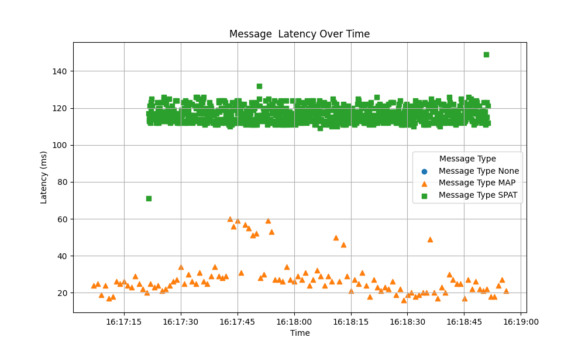
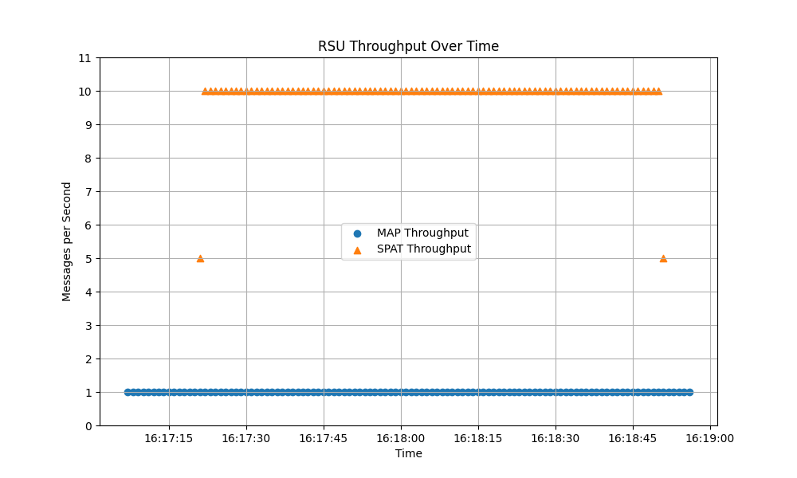

# V2X Hub Messaging Performance Analyzer

This tool is intended analyze performance of V2X Hub messaging. This includes V2X Hub/RSU **latency**, **message drop** and **message frequency**. This tool ingests the output logfiles of the **JSON Message Logger Plugin** as well as the decoded pcaps of recorded traffic from RSUs.

> [!IMPORTANT]  
> To decode the pcap data from an RSU please use the **[pcapdecoder](https://github.com/usdot-fhwa-stol/pcapdecoder)** tool. After using this tool `.pcap` files should be converted to `.log` files of decoded JSON data

## Prerequisites

As mentioned above, this tool assumes all data is in the format of logs files. The format of these logs files should look roughly as follows. To convert pcap files captured on an RSU to logs files please use **[pcapdecoder](https://github.com/usdot-fhwa-stol/pcapdecoder)** tool.

```csv
1765297041550 : {"messageId":19,"value":{"SPAT":{"intersections":[{"name":"Intersection","id":{"id":1},"revision":1,"status":"0000","moy":493457,"timeStamp":21479,"states":[{"signalGroup":1,"state-time-speed":[{"eventState":"dark","timing":{"minEndTime":10414}}]},{"signalGroup":2,"state-time-speed":[{"eventState":"protected-Movement-Allowed","timing":{"minEndTime":10514,"maxEndTime":10514}}]},{"signalGroup":22,"state-time-speed":[{"eventState":"stop-And-Remain","timing":{"minEndTime":10844}}]},{"signalGroup":3,"state-time-speed":[{"eventState":"dark","timing":{"minEndTime":10414}}]},{"signalGroup":4,"state-time-speed":[{"eventState":"stop-And-Remain","timing":{"minEndTime":10544,"maxEndTime":10544}}]},{"signalGroup":24,"state-time-speed":[{"eventState":"stop-And-Remain","timing":{"minEndTime":10544}}]},{"signalGroup":5,"state-time-speed":[{"eventState":"dark","timing":{"minEndTime":10414}}]},{"signalGroup":6,"state-time-speed":[{"eventState":"protected-Movement-Allowed","timing":{"minEndTime":10514,"maxEndTime":10514}}]},{"signalGroup":26,"state-time-speed":[{"eventState":"stop-And-Remain","timing":{"minEndTime":10844}}]},{"signalGroup":7,"state-time-speed":[{"eventState":"stop-And-Remain","timing":{"minEndTime":10544,"maxEndTime":10544}}]},{"signalGroup":8,"state-time-speed":[{"eventState":"stop-And-Remain","timing":{"minEndTime":10544,"maxEndTime":10579}}]},{"signalGroup":28,"state-time-speed":[{"eventState":"stop-And-Remain","timing":{"minEndTime":10544}}]}]}]}}}

```

## Usage
```
usage: v2xhub_messaging_performance_analyzer.py [-h] [--input_dir INPUT_DIR] [--debug]

Analyze V2X messaging performance from log files.

options:
  -h, --help            show this help message and exit
  --input_dir INPUT_DIR
                        Directory containing RSU and V2X Hub log files
  --debug               Enable debug logging
```

## Output

Below we show example plots for message latency and through put.
 
 

