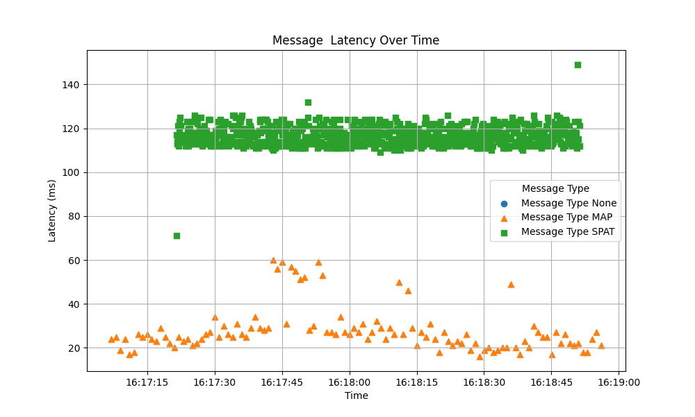
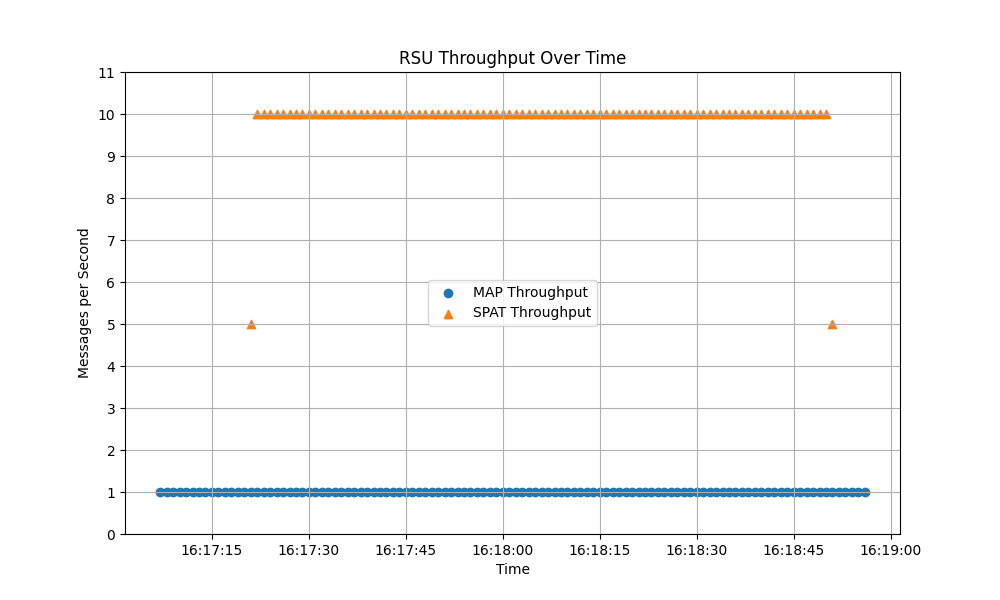

# V2X Hub Messaging Performance Analyzer

This tool is intended to analyze performance of V2X Hub messaging. This includes V2X Hub/RSU **latency**, **message drop** and **message frequency**. This tool ingests the output logfiles of the **JSON Message Logger Plugin** as well as the decoded pcaps of recorded traffic from RSUs.

> [!IMPORTANT]  
> To decode the pcap data from an RSU please use the **[pcapdecoder](https://github.com/usdot-fhwa-stol/pcapdecoder)** tool. After using this tool `.pcap` files should be converted to `.log` files containing decoded JSON data

## Prerequisites

As mentioned above, this tool assumes all data is in the format of logs files. The format of these logs files should look roughly as follows. To convert pcap files captured on an RSU to logs files please use **[pcapdecoder](https://github.com/usdot-fhwa-stol/pcapdecoder)** tool.

```csv
1765297041550 : {"messageId":19,"value":{"SPAT":{"intersections":[{"name":"Intersection","id":{"id":1},"revision":1,"status":"0000","moy":493457,"timeStamp":21479,"states":[{"signalGroup":1,"state-time-speed":[{"eventState":"dark","timing":{"minEndTime":10414}}]},{"signalGroup":2,"state-time-speed":[{"eventState":"protected-Movement-Allowed","timing":{"minEndTime":10514,"maxEndTime":10514}}]},{"signalGroup":22,"state-time-speed":[{"eventState":"stop-And-Remain","timing":{"minEndTime":10844}}]},{"signalGroup":3,"state-time-speed":[{"eventState":"dark","timing":{"minEndTime":10414}}]},{"signalGroup":4,"state-time-speed":[{"eventState":"stop-And-Remain","timing":{"minEndTime":10544,"maxEndTime":10544}}]},{"signalGroup":24,"state-time-speed":[{"eventState":"stop-And-Remain","timing":{"minEndTime":10544}}]},{"signalGroup":5,"state-time-speed":[{"eventState":"dark","timing":{"minEndTime":10414}}]},{"signalGroup":6,"state-time-speed":[{"eventState":"protected-Movement-Allowed","timing":{"minEndTime":10514,"maxEndTime":10514}}]},{"signalGroup":26,"state-time-speed":[{"eventState":"stop-And-Remain","timing":{"minEndTime":10844}}]},{"signalGroup":7,"state-time-speed":[{"eventState":"stop-And-Remain","timing":{"minEndTime":10544,"maxEndTime":10544}}]},{"signalGroup":8,"state-time-speed":[{"eventState":"stop-And-Remain","timing":{"minEndTime":10544,"maxEndTime":10579}}]},{"signalGroup":28,"state-time-speed":[{"eventState":"stop-And-Remain","timing":{"minEndTime":10544}}]}]}]}}}

```

## Usage
```
usage: v2xhub_messaging_performance_analyzer.py [-h] [--debug] [--input-src] [--input-dst] [--output-dir]

Analyze V2X messaging performance from log files.

options:
  -h, --help            show this help message and exit
  --debug               Enable debug logging
  --input-src           Source log file
  --input-dst           Destination log file
  --output-dir          Output directory
```
### Interactive

When the script starts, it opens two file selection dialogs in order:

1. Select the source (transmit) log file.
: This should be the originating message stream (for example, V2X Hub Tx logs).
2. Select the destination (receive/forward) log file.
: This should be the corresponding downstream stream used for comparison (for example, RSU inbound ethernet logs).

After both files are selected, the script calculates message latency, message drops, and throughput, then writes results to:

- `./data` for intermediate CSV files
- `./plots` for generated charts

### Non Interactive

Using the three command line arguments, define: 
1. The source (transmit) log file
2. The destination (receive/forward) log file.
3. The main output directory
: This should be the overarching output folder that `./data` and `./plots` will be stored in.

After the command line arguments are set, the script calculates message latency, message drops, and throughput, then writes results to: 
- output_dir / 'data' for intermediate CSV files
- output_dir / 'plots' for generated charts

## Output

Below we show example plots for message latency and through put.
 
 

